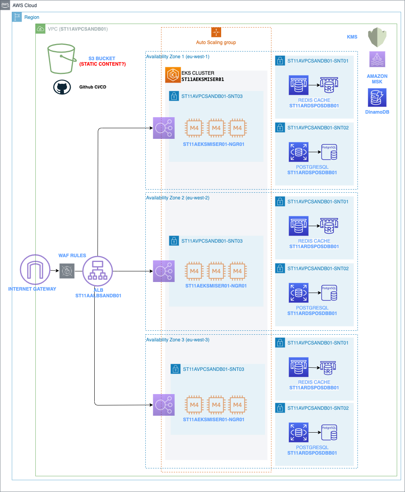
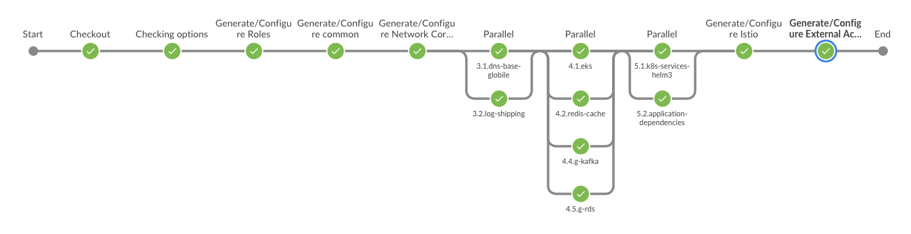

# Platform terraform AWS

This project defines all the code to deploy the public platform on AWS subscription. This project could be autogenerated and automanaged by the [CLI](https://www.google.com) or manually direcly creating and including new environment parameters and creating new pipelines. manually. 



The pipelines available are compatible with **Jenkins** and **github Actions**, the requirements are to have installed tools like terraform, and gcl-devops. In the next points all the information will be exposed and described. This project uses [another project](https://www.google.com) as a library instanciated using gitmodules. This project points to a specific version of this library, when you create a new project using the cli, the project is pointing to the last version. 

### **Table of Contents**

1. [ REQUIREMENTS ](#index_requirements)
2. [ GCL INTEGRATION ](#index_gclintegration)
3. [ MANUAL EXECUTIONS ](#index_manualexec)
4. [ PIPELINES ](#index_requirements)
    
    4.1 [ Jenkins ](#index_requirements)
    
    4.2 [ Github Actions ](#index_requirements)

**Note**: Any change over this version could break the compability with the current environment.

## 1. Requirements
<a name="index_requirements"/>

The code is based in terraform, and, the components current versions are based on terraform 0.12.28; Terraform uses differents providers, the most important:

| Provider | Version | Description |
| --- | --- | --- |
| `aws` | 3.0 | AWS provider to use all the AWS elements |
| `kubernetes` | lastversion | Functions to manage kuberentes cluster |
| `helm` | 1.2.4 | Handle helm package installation using version 3.0 |

This platform can be deployed in a free subscription of AWS and also in a corporate subscription, nevertheless, the network address should be alligned with the coporation in the second case. a user (key,password) with an administrator role is needed to deploy the services.

AWS Requirements:
- AWS service account
- Admin role with permissions to assume to the Service account.

To execute a CD process manually or with Orquestator you need a runner with the next configuration:
- Terraform 0.12.28
- Linux || MACOS
- AWS-CLI

In the case of Jenkisn, it is needed to install:
- AmazonWebServicesCredentialsBinding plugin in jenkins to keep the next secrets:
    - AWS_ACCESS_KEY_ID
    - AWS_SECRET_ACCESS_KEY
    - AWS_REGION

In the case of Githubactions:
- Vault with keyvault version1
- Keys:
    - AWS_ACCESS_KEY_ID
    - AWS_SECRET_ACCESS_KEY
    - AWS_REGION

## 2. Jarvis CLI integration
<a name="index_gclintegration"/>

With the aim to create a instance of this repository you can create Jarvis CLI, this cli automatically use a repository as image and create a new one with specific configuration. it would be possible to disable elements not required in a specic platform.

To know more information about jarvis CLI go to this [url](https://github.com/globile-software/devops-devcli-go-app).


## 3. Manual execution
<a name="index_manualexec"/>
The manual execurtion is based in tf.sh script. This script encapsulates the terraform files, environment files and state files automatically. Using this bash script it is possilbe to execute the creation, deletion or requets of any global components.

```bash
Usage: ./tf.sh

  ./tf.sh <environment> <infra-unit> <action> [tf options]

or alternatively:

  [assume-role <target-role>] ./tf.sh <environment> <infra-unit> <action> <target-role> [tf options]
  --> migrated to ./tf.sh  <target-role> <environment> <infra-unit> <action> [tf options]
Variable overview:
  <target-role> - the role in which to run the script as (hint: your roles have been defined under ~/.aws/config)
  <environment> - the target environment. Available environments: [ 'sandbox', 'dev', 'preprod', 'prod' ]
  <infra-unit> - the module/directory to apply the <action> to, as shown under the './infra/' directory
  <action> - the action to apply to the <infra-unit>. Available actions: 
        [ 'plan', 'apply', 'destroy', 'ciplan', 'ciapply', 'cidestroy', 'print', 'custom', 'fmt', 'validate' ]
  [tf options] - Other options

Examples:
  ./tf.sh dev eks plan
  assume-role sandbox-admin ./tf.sh sandbox vpc plan
ENV Variables:
  export INFRA_UNIT_DIR='PATH_TO_PROJECT'
````

The structure of the project is very important and the script is based on this structure:

```
/devops-iacaws-terraform-lib/
/devops-iacaws-terraform-lib/src/projects/
/devops-iacaws-terraform-lib/src/projects/apolo-platform
/devops-iacaws-terraform-lib/src/projects/platform-public
/devops-iacaws-terraform-lib/src/projects/shared-public
/envs/
/envs/sandbox/
/envs/develop/
/envs/prepro/

  ./tf.sh <environment> <infra-unit> <action> [tf options]
```
the library permit the creation of differents platforms, this platforms are located in the folder `/devops-iacaws-terraform-lib/src/projects/`
and you can point to each project usint the variable INFRA_UNIT_DIR, by default INFRA_UNIT_DIR is pointed to `/devops-iacaws-terraform-lib/src/projects/` platform-public´ but it is possilbe to change using ´export INFRA_UNIT_DIR=< folder path>

About the options:
- < environment > : any name of the folders inside /envs/ 
- < infra-unit >: any name availble inside the folder /devops-iacaws-terraform-lib/src/projects/< INFRA_UNIT_IDR >
- < action >: Could be apply, destroy, state or custom to do another options.

### 3.1 Execute creation of vpc of platform-public
First of all you need to go to the path of this project and once done you can execute the command:
```bash
cd < PROJECT PATH >
export PATH_TO_PROJECT="$(pwd)/devops-iacaws-terraform-lib/src/projects/platform-public"
./tf.sh sandbox 2.vpc apply
```

**Examples:**

* Execute creation of component on sandbox environment

First of all you need to go to the path of this project and once done you can execute the command:
```bash
cd < PROJECT PATH >
export PATH_TO_PROJECT="$(pwd)/devops-iacaws-terraform-lib/src/projects/platform-public"
./tf.sh sandbox 2.vpc destroy
```

* Execute deletion of component on sandbox environment

First of all you need to go to the path of this project and once done you can execute the command:
```bash
cd < PROJECT PATH >
export PATH_TO_PROJECT="$(pwd)/devops-iacaws-terraform-lib/src/projects/platform-public"
./tf.sh sandbox 2.vpc destroy
```

## 4. PIPELINES
<a name="index_manualexec"/>

The pipeline consists in a continuos sucessions of steps. Each step has dependencies with the before steps. If 2 modules doesn't have dependency between each other, they can be executed in paralell (valid only in Jenkins).




### 4.1 Jenkins Integration
<a name="index_manualexec"/>

The Jenkins pipeline are very simple, it consists in 2 pipelines per environment, 1 to create the environment/upgrade and the second to destroy the values. To modify the configuration, you could modify next environment variables:
- CONFIG_FILE: environments folder name of the environment to deploy 
- INFRA: With this project you could instanciate differents platforms.
- CREDENTIALID: credential name with the AWS keys.

### 4.2 Github Actions Integration
<a name="index_manualexec"/>

**TBD**